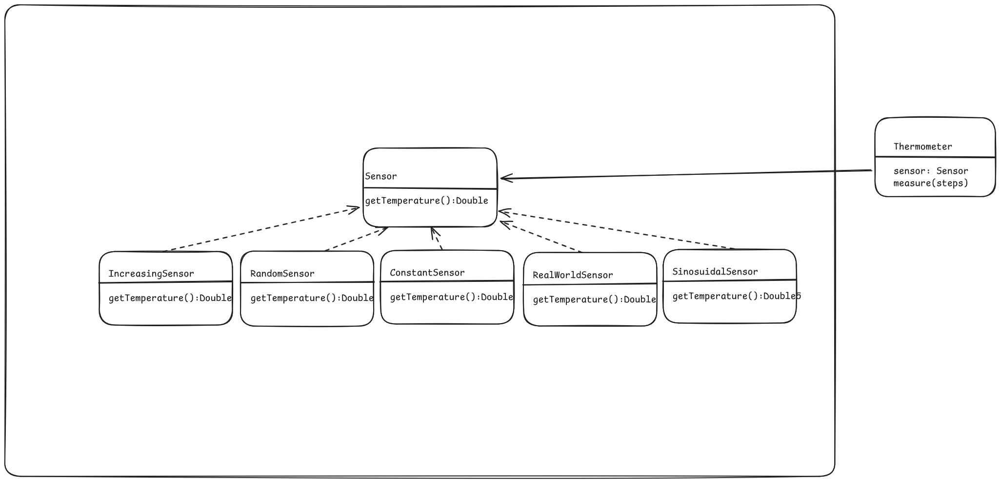

# P1
<details>
<summary>Aufgabe 1</summary>

### Strategien für Temperaturwerte

In der ersten Aufgabe legen Sie unterschiedliche Strategien an, um Temperaturwerte zu erhalten.

a) Definieren Sie eine Schnittstelle Sensor, welche die Methode getTemperature(): Double
besitzt. Über diese Methode liefert ein Sensor eine bestimmte Temperatur zurück. Dieser Typ
ist unsere (abstrakte) Strategie.

b) Es soll mehrere konkrete Strategien geben, die die Schnittstelle Sensor implementieren und
Temperaturwerte liefern. Die Strategien unterscheiden sich in dem Algorithmus, nach dem die
Temperaturwerte geliefert werden:

+ RandomSensor: liefert zufällige Temperaturwerte innerhalb eines Wertebereichs. Der Werte-
bereich wird über die beiden Eigenschaften min und max vom Typ Double festgelegt. Die
beiden Eigenschaften werden im Konstruktor übergeben.
+ ConstantSensor: liefert immer eine konstante Temperatur. Hierfür wird der im Konstruktor
übergebene Temperaturwert verwendet.
+ IncreasingSensor: liefert einen linear steigenden Temperaturverlauf. Hierfür wird zunächst
eine Starttemperatur im Konstruktor übergeben. Diese Temperatur wird bei jedem Zugriff
um 0.5 Grad erhöht.
+ RealWorldSensor: liefert die echte Temperatur für eine bestimmte Umgebung. Der Klas-
se werden zunächst die Koordinaten für einen Ort übergeben (Latitude und Longitude).
Bei jedem Zugriff auf getTemperature wird eine öffentliche Schnitstelle (API) angespro-
chen, die die aktuelle Temperatur für die Koordinaten zurückgibt. Die vollständige Im-
plementierung sollen Sie sich hieraus kopieren: https://gist.github.com/alexdobry/
d192b9daf218a00678f5e6709a263f27. Schauen Sie sich die Implementierung an und ver-
suchen Sie diese nachzuvollziehen.
+ Bonus SinusoidalSensor: liefert einen sinusförmigen Temperaturverlauf. Informieren Sie
sich hierfür über harmonische Schwingungen bzw. Sinusschwingungen. Als Parameter be-
nötigen Sie die Amplitude, Frequenz und Phasenverschiebung (Veränderung über Zeit).

Testen Sie alle Sensoren, indem Sie diese instanziieren und die getTemperature-Methode in
einer Schleife aufrufen. Spielen Sie auch mit den Koordinaten des RealWorldSenor herum:
```
fun main () {
val randomSensor = RandomSensor (min = 2.0, max = 8.0) // liefert
zufällige Temperaturen zwischen 2.0 und 8.0 Grad
repeat (3) {
println ("Random Sensor ${ randomSensor . getTemperature ()}")
}
val constantSensor = ConstantSensor (temp = 21.5) // liefert jedes Mal
21.5 Grad
repeat (3) {
println (" Constant Sensor : ${ constantSensor . getTemperature ()}")
}
val increasingSensor = IncreasingSensor ( startTemp = 15.0) // fängt bei
15 Grad an und erhöht jedes mal die Temperatur um 0.5 Grad
repeat (3) {
println (" Increasing Sensor ${ increasingSensor . getTemperature ()}")
}
val realWorldSenor = RealWorldSenor (51.023080 , 7.562183) //
Koordinaten für den Campus Gummersbach
println ("Real World Sensor ")
println (" Gummersbach : ${ realWorldSenor . getTemperature ()}")
// Koordinaten für Köln
realWorldSenor .lat = 50.941319
realWorldSenor .long = 6.958210
println ("Köln: ${ realWorldSenor . getTemperature ()}")
}
```
Die Konsolenausgabe kann beispielsweise so aussehen:
> Random Sensor: 6.496897428041999\
> Random Sensor: 3.5319770622098154\
> Random Sensor: 7.782588831959013\
> Constant Sensor: 21.5\
> Constant Sensor: 21.5\
> Constant Sensor: 21.5\
> Increasing Sensor: 15.5\
> Increasing Sensor: 16.0\
> Increasing Sensor: 16.5\
> Gummersbach : 2.6\
> Köln: 6.8

</details>

<details>
<summary>Aufgabe 2</summary>

### Strategien verwenden
In dieser Aufgabe sollen die ersten Vorteile der Strategie ersichtlich werden. Hierfür benötigen
wir einen Client, der die Strategie verwendet.

a) Schreiben Sie eine Klasse Thermometer, die einen Sensor im Konstruktor entgegennimmt.
Diese Variable sollte veränderlich sein, damit Sie die Strategie später austauschen können.
Implementieren Sie die Methode ```measure(times: Int)```, welche die repeat-Funktion verwendet,
um times Mal die Temperatur vom Sensor abzufragen (siehe main Funktion der letzten Seite
für die Verwendung von repeat).

b) Erzeugen Sie ein Thermometer in der main Funktion. Übergeben Sie dem Thermometer
eine der in Aufgabe 1 definierten Strategien. Rufen Sie jeweils die measure Methode auf und
schauen Sie sich die Ausgaben in der Konsole an. Überprüfen Sie, ob die ausgegebenen Werte
der Implementierung der Strategie entsprechen.
Beispielhafte Verwendung:
```
fun main () {
// Thermometer mit erster Strategie initialisieren
val thermometer = Thermometer (sensor = RandomSensor (2.0 , 8.0))
thermometer . measure (10)
}
```
c) Nach dem Aufruf der measure Funktion: Ändern Sie die Strategie des Thermometers auf
eine andere Strategie. Rufen Sie erneut die measure Methode auf und schauen Sie sich die
Ausgaben in der Konsole an. Nun sollten die ausgegebenen Werte der Implementierung der
anderen Strategie entsprechen.
Beispielhafte Verwendung:
```
fun main () {
// Code von oben ...
// Strategie wechseln
thermometer .sensor = IncreasingSensor ( startTemp = 15.0)
thermometer . measure (10)
}
```

d) Welchen Vorteil bringt die Strategie für dieses Beispiel?

A:

e) Inwiefern wird das objektorientierte Design Prinzip “encapsulate what varies” erfüllt? Was
unterscheidet sich? Was bleibt gleich?

A:

f) Zeichnen Sie das allgemeine Strukturdiagramm für den bisherigen Code.


</details>

<details>
<summary>Aufgabe 3</summary>

### Sensoren dekorieren

In dieser Aufgabe sollen die Strategien aus Aufgabe 1 um weitere Funktionalitäten erweitert
werden.

a) Implementieren Sie die folgenden Dekorierer:

+ SensorLogger: Schreibt bei jeder Temperaturabfrage den aktuellen Wert auf die Konsole.
Kostenausgaben sollen ausschließlich über diesen Dekorierer erfolgen. Entfernen Sie alle
anderen Ausgaben.
+ RoundValues: Rundet die Temperatur auf ganze Zahlen. So wird beispielsweise 19.4 zu 19.0
gerundet.
+ FahrenheitSensor: Rechnet den Temperaturwert von Celsius in Fahrenheit um.

b) Testen Sie jetzt die Dekorierer, indem Sie folgende Aufgaben erledigen:
+ Erzeugen Sie einen Sensor, welcher zufällige Temperaturen zwischen 2.0 und 5.0 rundet
und diese auf der Konsole ausgibt.
+ Erzeugen Sie einen Sensor, welcher linear aufsteigende Temperaturen ab 20.0 Grad Celsius
in Fahrenheit umrechnet, diese danach rundet und anschließend auf der Konsole ausgibt.
+ Erzeugen Sie einen Sensor, der das gleiche wie in der Aufgabe davor macht, aber zusätzlich
die Temperatur in Celsius ausgibt, bevor in Fahrenheit umgerechnet wird.

Verwenden Sie diese dekorierten Sensoren in Ihrer main Funktion. Da Sie jeweils den SensorLogger
verwenden, müssten Sie die dekorierten Ergebnisse auf der Konsole sehen. Überprüfen Sie diese
Konsolenausgaben.

c) Ist die Reihenfolge beim Dekorieren relevant? Begründen Sie Ihre Antwort, indem Sie
prüfen, ob es einen Unterschied zwischen
```
val t1 = Thermometer(SensorLogger(RoundValues(RandomSensor(2.0, 5.0)))) und
val t2 = Thermometer(RoundValues(SensorLogger(RandomSensor(2.0, 5.0)))) gibt.
```

A:

d) Was für Vorteile bringt der Dekorierer? Hätte das alles auch mit weiteren Strategien funk-
tioniert? Wenn nein, was wäre das Problem gewesen?

A:

e) Was ist der grundsätzliche Unterschied zwischen einem Dekorierer und einer Strategie?
Wann wird was verwendet?

A:

f) Welche objektorientierten Design Prinzipien werden vom Dekorierer Muster erfüllt? Be-
gründen Sie Ihre Antwort.

A:

g) Erweitern Sie ihr allgemeines Strukturdiagramm um die weiteren Klassen.

</details>

<details>
<summary>Aufgabe 4</summary>

### Beobachten des Thermometers
In dieser Aufgabe werden Sie ermöglichen, dass andere Objekte das Thermometer beobachten
können und über Temperaturänderungen benachrichtigt werden.

a) Definieren Sie dazu eine Schnittstelle TemperatureObserver mit einer update(tmp: Double)
Methode. Diese Methode soll die neue Temperatur als Parameter erhalten.

b) Definieren Sie folgende Beobachter:
+ TemperatureAlert: Schreibt eine Nachricht auf der Konsole, wenn eine bestimmte Tempe-
ratur erreicht wird. Die Klasse nimmt den Schwellwert und die Nachricht im Konstruktor
entgegen. So wird z.B. die Nachricht “Ganz schön heiß” bei einer Schwelltemperatur von 30
Grad ausgegeben.
+ HeatingSystemObserver: Schaltet eine Heizung an oder aus, basierend auf der Durchschnitts-
temperatur der letzten 5 Temperaturen. Zunächst werden 5 Temperaturwerte in einer Liste
gesammelt. Wenn 5 Werte vorhanden sind, wird der Durchschnitt berechnet. Liegt der
Durchschnitt über einer bestimmten Grenze, wird “Heizung aus” auf der Konsole ausgege-
ben. Liegt der Durchschnitt unter einer bestimmten Grenze, wird “Heizung an” ausgegeben.
Anschließend wird die Liste für die nächsten 5 Temperaturen geleert. Die beiden Schwell-
werte werden im Konstruktor übergeben.

c) Das Thermometer ist das zu beobachtende Subjekt (Publisher). Daher muss es das folgende
Interface implementieren:
```
interface TemperatureSubject {
val observers : MutableList < TemperatureObserver >
fun addObserver (o: TemperatureObserver )
fun removeObserver (o: TemperatureObserver )
}
```
Implementieren Sie das Interface so, dass TemperatureObserver hinzugefügt und entfernt werden
können. Sorgen Sie auch dafür, dass alle registrierten TemperatureObserver benachrichtigt
werden, wenn sich die Temperatur ändert.

Testen Sie das Thermometer in Zusammenspiel mit den beiden Beobachtern, indem Sie z.B.
eine Benachrichtigung auf der Konsole ausgeben, sobald eine Temperatur über 30 Grad gemel-
det wird. Zudem soll die Heizung ab beispielsweise 19 Grad eingeschaltet und unter 23 Grad
ausgeschaltet werden.

Hier ein Beispiel:
```
fun main () {
val sensor = SensorLogger ( RoundValues ( RandomSensor (10.0 , 50.0)))
val thermometer = Thermometer (sensor = sensor )
val alertObserver = TemperatureAlert (
alertTmp = 30.0 ,
alertMsg = "Ganz schön heiß"
)
val heatingSystemObserver = HeatingSystemObserver (
offThreshold = 23.0 ,
onThreshold = 19.0
)
thermometer . addObserver ( alertObserver )
thermometer . addObserver ( heatingSystemObserver )
thermometer . measure (20)
}
```
Die Konsolenausgabe kann beispielsweise so aussehen:
> 15.0\
> 21.0\
> 9.0\
> 31.0\
> Ganz schön heiß\
> 32.0\
> Ganz schön heiß\
> Die Durchschnittstemperatur der letzten 10 Messungen ist 21.6\
> 33.0\
> Ganz schön heiß\
> 24.0\
> 7.0\
> 1.0\
> 1.0\
> Die Durchschnittstemperatur der letzten 10 Messungen ist 13.2\
> Heizung an!

d) Welches Problem löst ein Beobachter? Wie wäre die Alternative, wenn man beispielsweise
in Teilaufgabe 

A:

c) keinen Beobachter verwenden würde?

A:

e) Welche objektorientierten Design Prinzipien werden vom Beobachter Muster erfüllt? Be-
gründen Sie Ihre Antwort.

A:

</details>

<details>
<summary>Aufgabe 5</summary>

### Objektorientierte Programmierung

Ordnen Sie das gesamte Praktikumsblatt in das objektorientierte Paradigma ein.

a) Inwiefern werden die 4 Prinzipien der objektorientierten Programmierung erfüllt? Nen-
nen Sie hierfür ein paar Codestellen (Klassen, Methoden, etc.), das jeweilige Prinzip und den
Erfüllungsgrad.

A:

b) Inwiefern werden die typischen Merkmale der objektorientierten Programmierung erfüllt?
Nennen Sie auch hier ein paar Codestellen, das jeweilige Merkmal und ihre Begründung.

A:

c) Inwiefern tragen die verwendeten Entwurfsmuster zur Objektorientierung bei?

A:

d) Wurde der imperative oder der deklarative Programmierstil überwiegend verwendet? Nen-
nen Sie ein paar Beispiele.

A:

e) Überlegen Sie für sich, welche Techniken und Denkweisen Sie aus der Bearbeitung des
Praktikumsblattes mitnehmen.

A:
</details>
