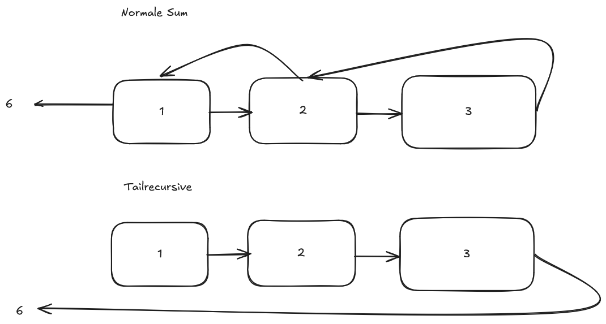

# 1 Fakten, Regeln und Anfragen
a) Bilden Sie den Familienstammbaum der Simpsons als Fakten ab:Wir verwenden SWI-Prolog: http://www.swi-prolog.org/
Online-Umgebung: https://swish.swi-prolog.org/
Aufgabe a) Fakten, Regeln und Anfragen
Bilden Sie den Familienstammbaum der Simpsons als Fakten ab.
Schreiben Sie folgende Prädikate als Regeln:
```
istVorfahre(P1,P2).
z.B.
?-istVorfahre(homer,bart).
true
?-istVorfahre(lisa,abraham).
false
```
Schreiben Sie weiterhin folgende Prädikate:
```
sindGeschwister(P1,P2).
istSchwesterVon(P1,P2).
istBruderVon(P1,P2).
```
Hinweis: Nutzen Sie möglichst wenig Fakten. Die Geschwister-Beziehu
z.B. daraus abgeleitet werden, dass beide dieselben Eltern haben.
Die Fakten können beispielsweise so aussehen:
```
1 % eltern_kind (Eltern , Kind)
2 eltern_kind (homer , bart).
3 eltern_kind (homer , lisa).
4 ...
```
b) Implementieren Sie ein Prädikat namens ist_vorfahre(P1, P2), welches prüft, ob P1 ein
Vorfahre von P2 ist. Nutzen Sie hierfür die Eltern-Kind Fakten. Die Verwendung ist dann
folgendermaßen:
```
1 ?- ist_vorfahre (homer , bart)
2 true %, weil Homer der Vater von Bart ist
3
4 ?- ist_vorfahre (lisa , marge)
5 false %, weil Lisa nicht die Mutter von Marge ist
```
c) Erweitern Sie das Prädikat, dass es über mehrere Generationen gilt. Hierfür muss das
Prädikat rekursiv implementiert werden. Beispielverwendung:
```
1 ?- ist_vorfahre (mona , bart)
2 true %, weil Mona über Homer die Oma von Bart ist
3
4 ?- ist_vorfahre (Wer , ling)
5 Wer = selma
6 Wer = clancy
7 Wer = jackie
8 % alle 3 sind Vorfahren von ling
```
d) Implementieren Sie das Prädikat sind_geschwister(P1, P2), welches prüft, ob P1 und P2
Geschwister sind. Nutzen Sie möglichst wenig Fakten. Die Geschwister-Beziehung zwischen
Bart und Lisa soll z.B. daraus abgeleitet werden, dass beide die selben Eltern haben. Bei-
spielverwendung:
```
1 ?- sind_geschwister (bart , lisa)
2 true
3
4 ?- sind_geschwister (Wer , lisa)
5 Wer = bart
6 Wer = maggie
```
e) Implementieren Sie das Prädikat ist_schwester_von(P1, P2) und ist_bruder_von(P1, P2
), die jeweils prüfen, ob P1 die Schwester / der Bruder von P2 ist. Für die beiden Prädikate
müssen Sie zusätzlich als Fakt festhalten, wer männlich oder weiblich ist. Beispielverwendung:
```
1 ?- ist_schwester_von (Wer , ling)
2 false
3
4 ?- ist_schwester_von (Wer , bart)
5 Wer = maggie
6 Wer = lisa
7
8 ?- ist_bruder_von (Wer , bart)
9 false
10
11 ?- ist_bruder_von (Wer , homer)
12 Wer = herb
```
f) Führen Sie für eines der von Ihnen implementierten Prädikate eine Resolution auf einem
Blatt Papier durch. Sie können z.B. sind_geschwister(homer, Wer) verwenden.

A:
```
?- sind_geschwister(homer, herb)
    eltern_kind(_,[herb,homer]),
    member(homer,[herb,homer]),
        member(homer,[herb|homer])
            member(homer,[homer])
    member(herb,[herb,homer]),
        member(herb,[herb|homer])
    homer \= herb.
    
Redo
?- sind_geschwister(homer, Wer)
    eltern_kind(_,[herb|homer]),
    member(homer,[herb|homer]),
        member(homer,[herb|homer])
            member(homer,[homer])
     member(Wer,[herb,homer]).
        member(Wer,[herb|homer])
            member(Wer,[homer])
    homer \= homer.
Fail
    
Redo
?- sind_geschwister(homer, Wer)
    eltern_kind(_,[herb|homer]),
    member(homer,[herb|homer]),
        member(homer,[herb|homer])
            member(homer,[homer])
     member(Wer,[herb,homer]).
        member(Wer,[herb|homer])
            member(Wer,[homer])
                member(Wer,[])
Fail

Redo
?- sind_geschwister(homer, Wer)
    eltern_kind(_,Kinder),
    member(homer,Kinder),
        member(homer,[marge|patty,selma])
            mmember(homer,[patty|selma])
                member(homer,[selma])
                    member(homer,[])
Fail
                    
Redo
?- sind_geschwister(homer, Wer)
    eltern_kind(_,Kinder),
    member(homer,Kinder),
        member(homer,[bart|lisa,maggie])
            member(homer,[lisa|maggie])
                member(homer,[maggie])
                    member(homer,[])
Fail

Redo
?- sind_geschwister(homer, Wer)
    eltern_kind(_,Kinder),
    member(homer,Kinder),
        member(homer,[ling])
            member(homer,[])
Fail
        
    
```


# 2 Arbeiten mit Listen

a) Implementieren Sie die folgenden Listenprädikate:
```
1 % Setzt 'Size ' auf die Anzahl der Elemente in 'List '
2 count(List , Size):-
3
4 % Zählt , wie oft 'X' in 'List ' vorkommt . Das Ergebnis steht in 'Res '
5 countX (X, List , Res):-
6
7 % Setzt 'Sum ' auf die Summe aller Elemente von 'List '.
8 % Achtung : Dieses Prädikat soll nur mit Listen von Zahlen
funktionieren
9 sum(List , Sum):-
10
11 % Setzt 'Avg ' auf den Durchschnittswert aller Elemente in 'List '
12 % Achtung : Dieses Prädikat soll nur mit Listen von Zahlen
funktionieren
13 avg(List , Avg):-
Verwenden Sie die Prädikate, um die Implementierung zu testen:
1 ?- count ([1, 2, 3], N)
2 N = 3
3
4 ?- count ([], N)
5 N = 0
6
7 ?- countX (1, [1, 2, 3, 1, 5], N)
8 N = 2
9
10 ?- countX (1, [2, 3], N)
11 N = 0
12
13 ?- sum ([10 , 5, 3], N)
14 N = 18
15
16 ?- sum ([], N)
17 N = 0
18
19 ?- avg ([10 , 5, 3], N)
20 N = 6
21
22 ?- avg ([ hallo , welt], N)
23 false
```
b) Implementieren Sie count und sum auch endrekursiv.

c) Was ist der Vorteil einer endrekursiven Implementierung gegenüber einer normalrekursiven
Implementierung? Skizzieren Sie am Beispiel von sum, wie beide Implementierungen arbeiten
würden.

A: Endrekursive Lösungen lassen sich leicht zu iterativen lösungen optimieren und ermöglicht es so stackoverflows zu verhindern


d) Implementieren Sie zudem folgende Listenprädikate. Es reicht, wenn diese normalrekursiv
sind:
```
1 % Prüft , ob 'X' in 'List ' vorkommt
2 contains (X, List):-
3
4 % Setzt 'N' auf das Element mit dem Index 'I'
5 element_at_index (I, N, List):-
6
7 % Entfernt alle Vorkomnisse von 'X' in 'List '. Die neue Liste steht in
'Res '
8 remove (X, List , Res).
```
Verwenden Sie die Prädikate, um die Implementierung zu testen:
```
1 ?- contains (3, [1 ,2 ,3])
2 true
3
4 ?- contains (5, [1 ,2 ,3])
5 false
6
7 ?- element_at_index (0, X, [8 ,3 ,5])
8 X = 8 %, weil die 8 an der 0ten Stelle in List steht
9
10 ?- element_at_index (2, X, [8 ,3 ,5])
11 X = 5 %, weil die 5 an der 2ten Stelle in List steht
12
13 ?- element_at_index (4, X, [8 ,3 ,5])
14 false %, weil weil 4 nicht in der Liste vorkommt
15
16 ?- remove (5, [1,2,3], Res)
17 Res = [1 ,2 ,3] % 5 kommt nicht in [1 ,2 ,3] vor
18
19 ?- remove (2, [1,2,3], Res)
20 Res = [1 ,3] % 2 wurde entfernt
21
22 ?- remove (1, [], Res)
23 Res = [] % leere Liste
```